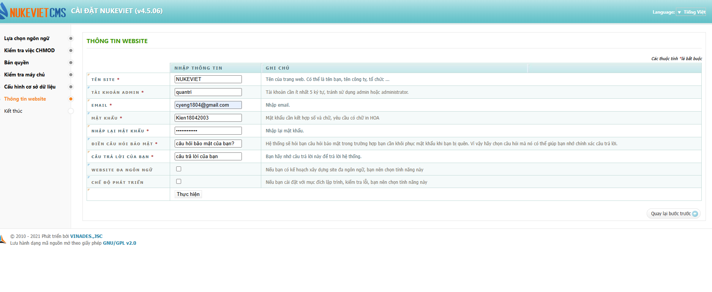
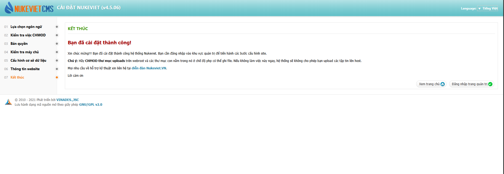

# NukeViet Project

## 📌 Giới thiệu
Đây là project cài đặt và chạy thử **NukeViet CMS**.  
Repo này bao gồm toàn bộ mã nguồn NukeViet đã được cài đặt và cấu hình cơ bản.  

## ⚙️ Yêu cầu hệ thống
- PHP: >= 5.6 và <= 8.3 (đã test với PHP 8.0.30)  
- MySQL/MariaDB  
- Apache/Nginx  
- PHP extensions: `pdo`, `curl`, `gd`, `xml`, `openssl`, `session`, `json`, `file_uploads`  

## 🚀 Các bước cài đặt
- Cấu hình thông tin website: 

- Kết thúc cài đặt:

